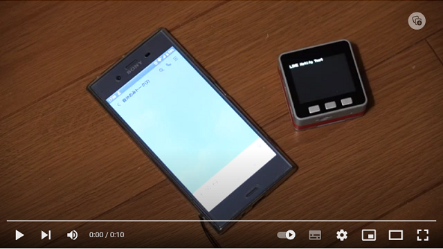

# LINE_Notify_M5Stack
A short sample Arduino IDE sketch to send a LINE notification

This sketch sends a notification to LINE, a popular messaging app in Japan, via its API from M5Stack. THe notification will be issued when you push buttons A, B, or C. A message appears on your LINE app on the smartphone.
Please kindly see the YouTube video below for how it operates.

